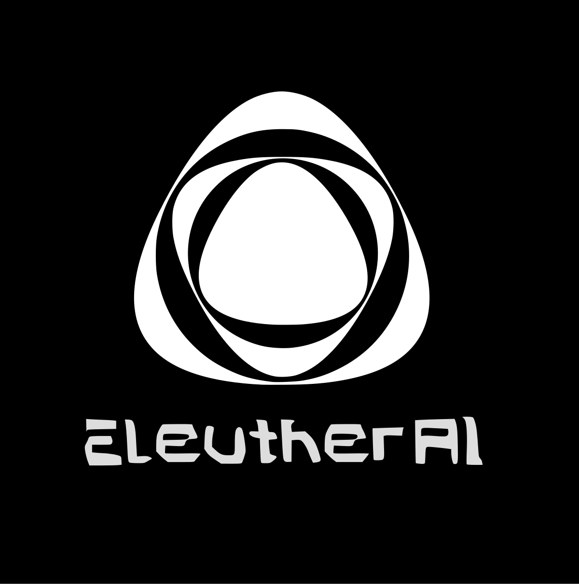

## RWKV 语言模型

RWKV（读作 RWaKuV）是一种具有 GPT 级大型语言模型（LLM）性能的 RNN，也可以像 GPT Transformer 一样直接训练（可并行化）。

RWKV 是一个开源的非盈利组织，隶属于 Linux 基金会，算力则由我们的赞助商支持。

RWKV 结合了 RNN 和 Transformer 的最佳特性 - 出色的性能、快速的推理、快速的训练、节省 VRAM、"无限" 的 ctxlen 和自由的句嵌入，而且是 100% 不含注意力机制的。

- [Discord 论坛](https://discord.gg/bDSBUMeFpc)
- [HF Gradio](https://huggingface.co/spaces/BlinkDL/RWKV-Gradio-2)

## RWKV 架构论文

- [arXiv (2305.13048) 论文](https://arxiv.org/abs/2305.13048)

## 当前版本状态

| 版本 | v4 - Raven | v4 - Dove | v5 - Eagle | v6 - Finch |
|---|---|---|---|---|
| 论文 | 🎓[论文在 EMNLP 2023 获得接受](https://arxiv.org/abs/2305.13048) | （无架构更改） | 🔧 稳定（当前版本） | 🧪 原型 |
| 总体状态 | 🌚 EOL - 建议使用 v5 世界 | 🌚 EOL - 建议使用 v5 世界 | ✅ 通用可用性 | 🧪 早期训练 |
| 0.4B 模型 | [完全训练 : rwkv-pile-430m](https://huggingface.co/RWKV/rwkv-4-430m-pile) | [完全训练](https://huggingface.co/RWKV/rwkv-4-world-430m) | ✅ [完全训练](https://huggingface.co/BlinkDL/rwkv-5-world/blob/main/RWKV-5-World-0.4B-v2-20231113-ctx4096.pth) | 🧪 早期训练 |
| 1.5B 模型 | [完全训练 : rwkv-raven-1b5](https://huggingface.co/RWKV/rwkv-raven-1b5) | [完全训练](https://huggingface.co/RWKV/rwkv-4-world-1b5) | ✅ [完全训练](https://huggingface.co/BlinkDL/rwkv-5-world/blob/main/RWKV-5-World-1B5-v2-20231025-ctx4096.pth) | ✅ [完全训练](https://huggingface.co/BlinkDL/rwkv-6-world/blob/main/RWKV-x060-World-1B6-v2-20240208-ctx4096.pth) |
| 3B 模型 | [完全训练 : rwkv-raven-3b](https://huggingface.co/RWKV/rwkv-raven-3b) | [完全训练](https://huggingface.co/RWKV/rwkv-4-world-3b) | ✅  [完全训练](https://huggingface.co/BlinkDL/rwkv-5-world/blob/main/RWKV-5-World-3B-v2-20231118-ctx16k.pth) | 🧪 早期训练 |
| 7B 模型 | [完全训练 : rwkv-raven-7b](https://huggingface.co/RWKV/rwkv-raven-7b) | [完全训练](https://huggingface.co/RWKV/rwkv-4-world-7b) | ✅  [完全训练](https://huggingface.co/RWKV/v5-Eagle-7B/blob/main/RWKV-v5-Eagle-World-7B-v2-20240128-ctx4096.pth) | ... |
| 14B 模型 / 7B 2T 模型 | [完全训练 : rwkv-raven-14b](https://huggingface.co/RWKV/rwkv-raven-14b) | 未计划 | 计划中 | ... |
| 8x7B MoE 模型 | 未计划 | 未计划 | 计划中 | ... |

## 与现有 Transformer 模型相比

**好处**

+ 运行和训练时资源使用更低（VRAM、CPU、GPU 等）。
+ **与较大上下文的 Transformer 相比，计算需求低 10 倍到 100 倍**。
+ 以线性方式扩展到任何上下文长度（Transformer 以二次方扩展）。
+ 在答案质量和能力方面的表现与 Transformer 一样好。
+ RWKV 模型通常在其他语言（例如中文、日文等）的训练上比大多数现有的开源模型要好。

**不足**

+ 对提示词（prompt）的格式非常敏感，您可能需要了解如何提示 RWKV 模型。
+ 在需要回顾的任务上较弱，因此需要相应地对提示词进行重新排序。
    + （例如，不能对 RWKV 模型说“对于上面的文档，执行某个任务”，因为这种提示词需要模型进行回顾。相反地，我们需要在给 RWKV 的提示词中说“对于下面的文档，执行某个任务”）。

## 谁赞助了 RWKV 的计算？

RWKV 作为一个开源项目，得益于 Stability AI、EleutherAI 和其他贡献者提供的大量 GPU 计算和研究时间的支持。

    
    

---

此外，我们还要感谢
- [alpin @ pygmalionAI](https://pygmalion.chat/)
- [AutoMeta @ AlignmentLab](https://twitter.com/alignment_lab)
- [Recursal.AI](https://recursal.ai)
- 以及其他提供 GPU 时间片段 / 选择不公开姓名的各位

同时，我们也感谢在较小的实验、微调和各种类型的模型上努力的 RWKV 贡献者们，特别是对于那些因运行失败而从未公开发布的模型。

## RWKV 社区术语

- **RWKV** - 模型架构本身，代码可在 [https://github.com/BlinkDL/RWKV-LM](https://github.com/BlinkDL/RWKV-LM) 找到
- **RWKV World** - 正在训练的新基础模型，这类模型涵盖了更广泛、更多样化的数据集混合，包括来自 100 多种语言的样本，以及部分指令训练。
- **Raven** - 基础模型的官方微调版本，带有指令训练。
- **基础模型 / Pile Plus 模型** - RWKV 基础模型目前在 "The Pile" 上训练，加上其他数据集的混合，这类模型没有进行指令训练。

## 我应该使用哪些 RWKV 模型？

- 对于大多数用例，您应该使用预训练的、微调的 7B World 模型：
    - [模型文件链接](https://huggingface.co/BlinkDL/rwkv-4-world/blob/main/RWKV-4-World-7B-v1-20230626-ctx4096.pth) 
    - [HF 仓库链接](https://huggingface.co/BlinkDL/rwkv-4-world)
- 在特定情况下，您可能会发现旧的（数据集较小）但更大的 Raven 模型，在某些特定基准测试中表现更好。当 14B World 模型准备就绪时，它将在所有用例中替换 Raven 模型。
    - [HF 仓库链接](https://huggingface.co/BlinkDL/rwkv-4-raven)
- 如果您想对一个非常特定的用例去微调模型，但没有任何现有的指令调整，您可能会发现 Pile 模型更有用（很少见，在大多数用例中，微调的 World 或 Raven 模型表现最好）。
    - [HF 仓库链接](https://huggingface.co/BlinkDL/rwkv-4-pile-14b)