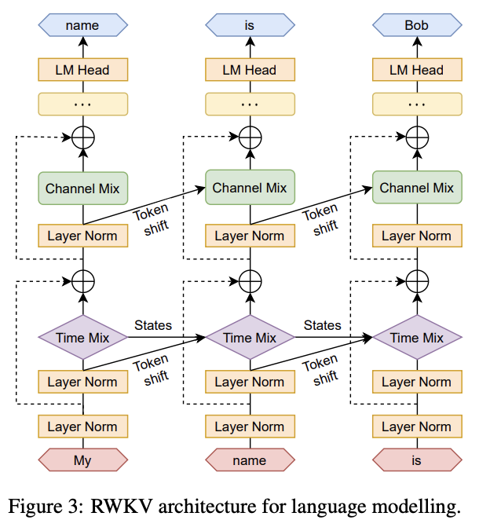

> Tips:
> 如果你对机器学习不熟悉，我强烈推荐 [Andrej Karpathy](https://www.youtube.com/watch?v=VMj-3S1tku0&list=PLAqhIrjkxbuWI23v9cThsA9GvCAUhRvKZ&ab_channel=AndrejKarpathy) - 关于神经网络的系列讲座，这将有助于提供各种神经网络架构概念的良好基础。

## 什么是经典 RNN 网络？/ 什么是隐藏状态？

RNN 网络，在其最简单的形式中，是一种 AI 神经网络。它使用一个隐藏状态，这个状态通过一个函数不断更新，因为它处理每个输入 token 时预测下一个 token（如果需要的话）。

随着每个 token 的处理，它被用来反馈到 RNN 网络中更新其状态并预测下一个 token，循环直到达到目标完成状态。这个隐藏状态可以被视为 AI 模型的“心理状态”。

RWKV 可以被视为 RNN 的一个修改变种。

## RWKV 与经典 RNN 有何不同？

传统的 RNN 由于它们的顺序性质，需要完全处理一个 token 及其隐藏状态才能处理下一个，这使得它们很难并行化并用 GPUs 训练，使得大规模训练语言模型变得困难。

RWKV 通过将完整的 RNN 网络分割成多个较小的层来缓解这个问题，其中每一层的隐藏状态可以独立用来计算同一层的下一个 token 隐藏状态。这允许下一个 token 状态部分并行计算，同时等待第一个隐藏状态的完整计算，呈现出类似瀑布式的模式。

以下 gif 演示了大约 3 层（高度）和 25 个 tokens（宽度）的并行瀑布式特性。

实际上，这允许 RNN 网络像 Transformer 网络一样操作，当并排展开时，它可以“像 Transformer 一样”训练并“像 RNN 一样”执行（两全其美）。

这是通过结合 token 移位、通道和时间混合来代替 LSTM 并计算下一个层/隐藏状态实现的。

> 注意：瀑布图表示理论上的最佳表现。在实践中，一些训练器和/或推理实现可能会将瀑布批量化为 tokens 块（32/64/128/256/512）以减少 VRAM 查找和延迟，并提高总体性能。

## 什么是通道/时间混合？用简单的话解释一下？

通道混合是一个过程，其中正在生成的下一个 token 与前一层的上一个状态输出混合，以更新这个“心理状态”。由于它不能从前一个迭代读取自己的通道混合层输出状态，通道混合中的信息只能通过层逐步向上流动——可以把这视为短期、精确的记忆的类比。

时间混合是一个类似的过程，但它允许模型保留部分先前的心理状态，使其能够选择并存储更长时间的状态信息，由模型决定。这是通过模型训练来实现的，如果它被训练为这样做，可能允许它无限期地保留过去的数据——可以把这视为长期、较低准确性记忆的类比。

因为当前 token 可以通过通道和时间混合的各种形式读取过去的状态数据，它提供了一个替代“注意力”模型的方式。关键信息存储在隐藏状态中（由模型权重决定），跨各个层与当前 token 对比，根据其训练应用各种效果。这有效地提供了一种“训练有素的注意力”，即过去 tokens（存储在隐藏状态中）对当前 token 的关注。

> PS：上述是一个不准确的过度简化。阅读下面的论文/链接以获取更深入的细节。

## RWKV 是如何工作的？/ 我想了解细节，我该去哪里找？

一个好的起点是查看 [RWKV 150 行代码](https://github.com/BlinkDL/ChatRWKV/blob/main/RWKV_in_150_lines.py)，它提供了 RWKV 核心概念的基本理解。

你可以在以下两篇博客文章： [这里](https://johanwind.github.io/2023/03/23/rwkv_details.html)和[这里](https://github.com/uasi/rwkv-in-150-lines-ex)找到 150 行代码的更详细解释。

或者，你可以通过 [RWKV 论文](https://arxiv.org/abs/2305.13048) 学习它。

或者观看 [Yannic Kilcher 在 youtube 上逐步分解这篇论文](https://www.youtube.com/watch?v=x8pW19wKfXQ&pp=ygUEUldLVg%3D%3D) 。

如果你想了解所涉及的数学，可以在这里找到相关博客文章：[https://ben.bolte.cc/rwkv](https://ben.bolte.cc/rwkv)

最后，一旦你对基础有了掌握，你可以开始在[RWKV 主仓库](https://github.com/BlinkDL/RWKV-LM)中研究训练和 CUDA 代码。

**附加链接/资源**

- 关于 RWKV 架构的笔记：[https://www.ivanleo.com/blog/a_guide_to_rwkv](https://www.ivanleo.com/blog/a_guide_to_rwkv)
- RWKV 模型数学：[https://ben.bolte.cc/rwkv-model](https://ben.bolte.cc/rwkv-model)
- RWKV 解释：[https://fullstackdeeplearning.com/blog/posts/rwkv-explainer/](https://fullstackdeeplearning.com/blog/posts/rwkv-explainer/)
- RWKV 如何工作：[https://johanwind.github.io/2023/03/23/rwkv_details.html](https://johanwind.github.io/2023/03/23/rwkv_details.html)
- RWKV training cost estimate (outdated): [https://johanwind.github.io/2023/03/23/rwkv_overview.html](https://johanwind.github.io/2023/03/23/rwkv_overview.html)