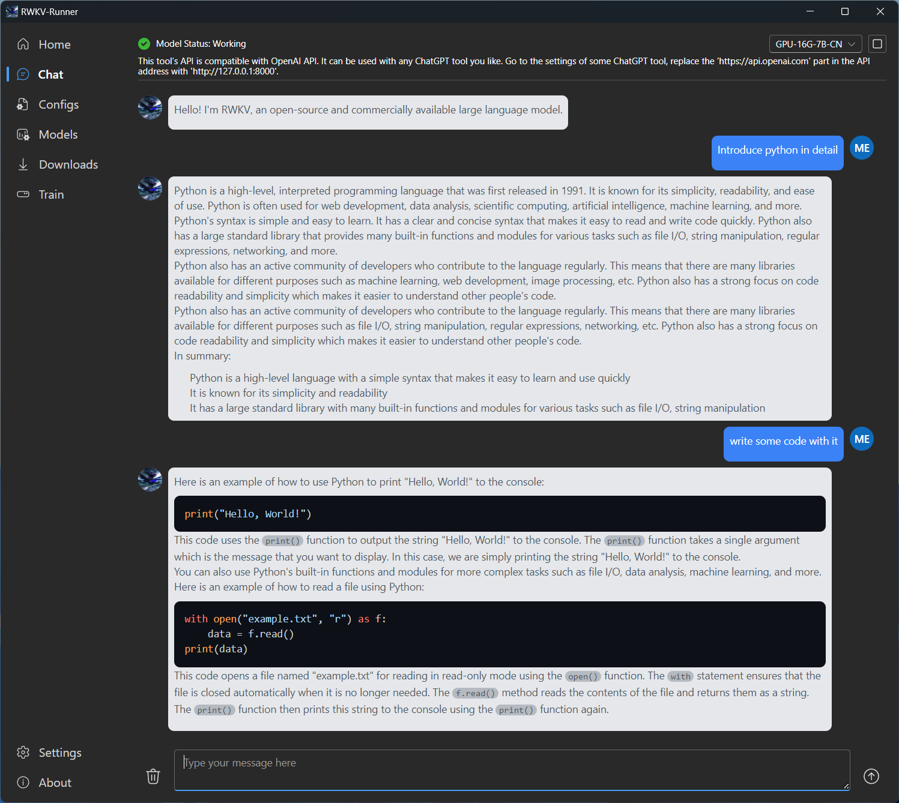

## 在线公共演示

如果你只是想尝试一下 RWKV 模型，可以尝试以下公共演示：

- [HF Gradio](https://huggingface.co/spaces/BlinkDL/RWKV-Gradio-2)


> 💡上述 HF 公共 Demo 中禁用了聊天模式，只能体验续写模式。


## 本地运行 RWKV 的最小步骤（推荐路径）

如果你不熟悉 python 或 huggingface，可以使用以下应用来本地安装聊天模型：

- [RWKV Runner项目](https://github.com/josStorer/RWKV-Runner)
    - [安装程序下载（请阅读安装程序 README 指南）](https://github.com/josStorer/RWKV-Runner/releases/)

[](https://github.com/josStorer/RWKV-Runner)


## RWKV 的提示（Prompting）指南

与基于 Transformer 的模型相比，RWKV 对提示格式更敏感。

由于 RWKV 在“回顾”能力上较弱，因此，不应该使用下面这种格式：

```
{{CONTEXT}}

{{INSTRUCTION}}

{{ANSWER}}
```

而应该使用像下面这样的格式：

```
{{INSTRUCTION}}

{{CONTEXT}}

{{ANSWER}}
```

用一个人类的比喻来说，你可以认为指令/输入（INSTRUCTION）被大声读给模型听，但不允许模型记下来。

如果模型先被告知上下文（CONTEXT）而不是指令（INSTRUCTION），它就不知道该如何处理上下文，且可能记不起指令中最关键的部分。因为它在接收上下文时，还没有被告知该怎么处理这些内容。

但如果你先告诉模型指令，然后再给模型输入上下文。它就会先理解指令，然后使用指令中包含的知识来处理上下文。

对于有上下文的问答任务，最优的方式是在上下文前后重复几个同类的问题，以此为模型作示范，如下所示：

```
{{QUESTION}}

{{CONTEXT}}

{{QUESTION}}

{{ANSWER}}
```

## 如何使用自定义模型？

如果你不是在寻找上述“基础指导”内容，而是想尝试不同的模型大小/量化设置。以下是你可能需要的各种内容：

### 指令训练模型下载
- [Raven](https://huggingface.co/BlinkDL/rwkv-4-raven/tree/main)

### 基础模型下载
- [Pile 7B](https://huggingface.co/BlinkDL/rwkv-4-pile-7b)
- [Pile 14B](https://huggingface.co/BlinkDL/rwkv-4-pile-14b)
- [PilePlus 模型](https://huggingface.co/BlinkDL/rwkv-4-pileplus)
- [RWKV World](https://huggingface.co/BlinkDL/rwkv-4-world)

::: tip
强烈建议尝试 raven 指令模型，除非你熟悉使用基础模型进行少量提示。
:::

### RWKV.cpp/RWKV.cpp cuda项目

下载所需的模型后，你可以量化或转换它们，以便针对 RWKV.cpp/RWKV-cpp-cuda 项目运行。

- [RWKV.cpp](https://github.com/saharNooby/rwkv.cpp)
- [RWKV-cpp-cuda](https://github.com/harrisonvanderbyl/rwkv-cpp-cuda)

这些项目旨在本地运行，无需 python 或 huggingface，并可分别在 CPU 或 GPU（或两者）上运行。


> 尽管名字中有"cuda"，但事实上 rwkv-cpp-cuda 也支持 vulkan，这意味着它可以在 AMD GPU 上运行。


### RWKV 移动端项目

- [AltaeraAI: 在你的安卓手机上运行 RWKV](https://altaera.ai/)（可能需要一些 CLI 知识才能运行）

### 聊天客户端项目

官方 RWKV 聊天项目可以在这里找到：
- [ChatRWKV](https://github.com/BlinkDL/ChatRWKV)

### RWKV 主仓库

RWKV 主仓库可以在这里找到，使用 v4neo 运行当前模型：
- [RWKV](https://github.com/BlinkDL/RWKV-LM/tree/main/RWKV-v4neo)


> 对于新手用户，除非你计划进行微调，由于 python 依赖项的复杂性，建议使用 RWKV.cpp 项目。


如果你安装了 NPM ，可通过以下 CLI 与模型交互：

### RWKV cpp node（稍微过时）

- [RWKV-cpp-node CLI](https://www.npmjs.com/package/rwkv-cpp-node)

```bash
# 全局安装，不要使用 NPX，因为它有已知的显示问题
npm install -g rwkv-cpp-node

# 运行设置，并使用聊天演示
rwkv-cpp-node
```